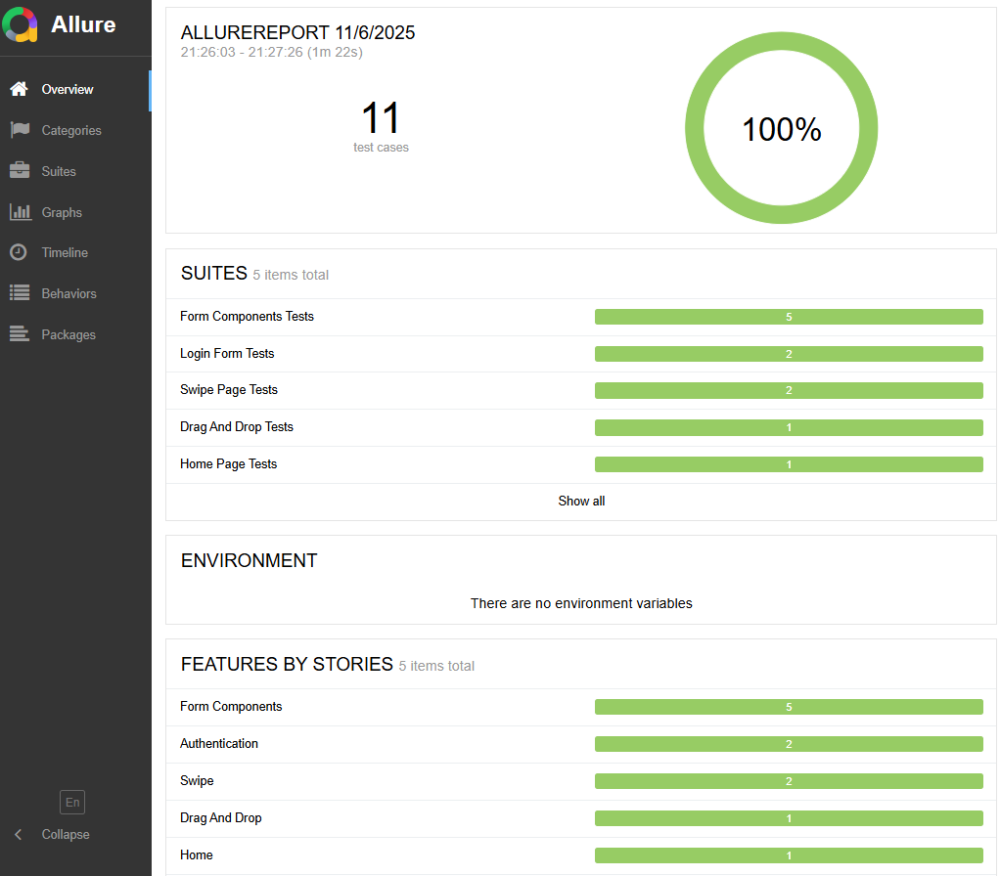
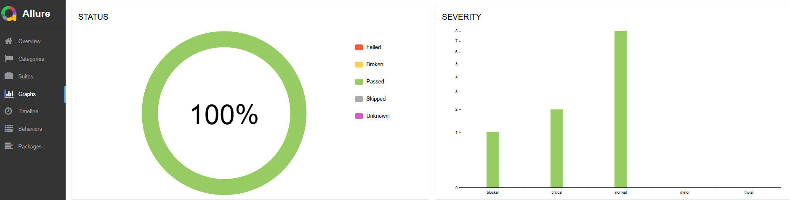
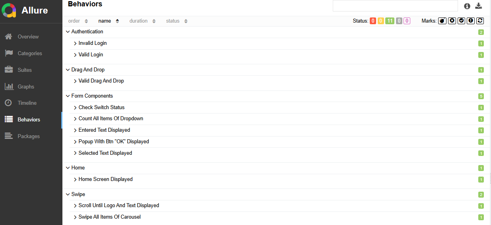

# Appium & WebdriverIO - Tests Mobiles automatisés - Portfolio 📱

## 📊 Vue d'ensemble

Portfolio de tests automatisés développé pour l'application Android [wdio native app](https://github.com/webdriverio/native-demo-app/releases), une application de démo.

**🎯 Objectif :** Démontrer mes compétences en automatisation de tests mobiles avec une approche professionnelle incluant CI/CD.

### 📈 Métriques du projet
- **11 tests automatisés** couvrant 5 modules fonctionnels
- **100% de réussite** sur le pipeline Jenkins
- **Type des test** : Tests fonctionnels et tests end-to-end
- **Architecture modulaire** Page Object Pattern :  
-- un fichier de page (classe, sélecteurs, méthodes)  
-- un fichier de test/spec (import du page object, scénarios de test)

---

## 🏗️ Architecture du projet

```
APPIUM-WEBDRIVERIO-PORTFOLIO/
├── 📁 apps/
│   ├── wdio-native-app.apk                       
├── 📁 results/
│   ├── 📁 allure-report
│   ├── 📁 allure-results
├── 📁 screenshots/                        
│   ├── *.png 
├── 📁 test/                       
│   ├── 📁 pagesobjects
│   ├──── *.page.js                 
│   ├── 📁 specs/
│   ├──── *.test.js                     
├── .env.example     
├── .gitignore
├── README.md
├── package-lock.json
├── package.json
├── wdio.config.js
├── 📁 node_modules/    

```

### Supports
- **[Documentation WebdriverIO](https://webdriver.io/docs/api)**
- **[Vidéos Appium Javascript](https://testautomationu.applitools.com/appium-javascript-tutorial/)**


## 🚀 Technologies utilisées

| Technologie | Usage |
|-------------|-------|
| **Appium** | Serveur d'automatisation mobile |
| **WebdriverIO** | Framework de test d'automatisation web et mobile |
| **Uiautomator2** | Driver Android |
| **Android Studio** | Émulateur |
| **Appium Inspector** | Inspecteur d'éléments de l'application |
| **Jenkins** | Pipeline CI/CD |
| **Allure** | Rapports |
| **Git / GitHub** | Versioning |

---

## 🛠️ Installation et exécution

### Prérequis
- Node.js 18+
- Java JDK 11+
- Android Studio avec émulateur configuré
- Appium 3.x

### Installation
```bash
# Cloner le repo
git clone https://github.com/Lesly-Nupert/Appium-Webdriverio-tests-mobiles-automatises-Portfolio

# Installer les dépendances
npm install
```

### Exécution les tests
```bash
# Tous les tests avec rapport Allure en local
npm run test:local

# Tous les tests avec rapport Allure en CI/CD Jenkins
npm run test:ci

# Un seul fichier de test
npm run testOne

# Générer le rapport Allure
npm run report
```

## 🤖 Pipeline Jenkins

**Configuration actuelle :**
* **Déclenchement** : Manuel via interface Jenkins
* **Environnement** : Local (java -jar jenkins.war)
* **Tests** : 11 tests automatisés en 1 min 38s


## 📈 Rapports et métriques

### Types de rapports générés
Les rapports affichent automatiquement :
- Taux de réussite/échec
- Statistiques par niveau de criticité  
- Indicateurs pour décisions Go/No-Go
- Screenshots des tests en échec

### Niveaux de criticité

- **blocker** : Bug qui bloque tout 
- **critical** : Fonctionnalité critique
- **normal** : Fonctionnalité importante mais contournable
- **minor** : Problème mineur 
- **trivial** : Détails sans impact fonctionnel

## 🤔 Défis Techniques et Solutions
**1. Attente explicite des éléments d'un tableau**  
**Défi** : La méthode `waitForDisplayed()` ne fonctionne pas avec les sélecteurs `$$()`.  
**Solution** : Utilisation de `browser.waitUntil()` avec une condition vérifiant que la longueur du tableau d'éléments est supérieure à zéro.

**2. Test instables en environnement CI/CD**  
**Défi** : Les tests échouaient en Jenkins "element not displayed after..." alors qu'en Local ils passaient.  
**Solution** : Augmentation du `waitforTimeout` dans `wdio.conf.js`

**3. Configuration des variables d'environnement pour Jenkins**  
**Défi** : Jenkins ne détectait pas l'émulateur Android ni le chemin de l'APK, car les variables d'environnement n'étaient pas configurées.  
**Solution** : Configuration de `ANDROID_HOME`, `JAVA_HOME`, `PATH+EXTRA` et `APP_PATH` dans les variables d'environnement Jenkins à l'aide de Claude IA.

## 📸 Captures d'écran

### Tests en exécution
*[Gif de l'exécution des tests avec l'émulateur]*


### Pipeline Jenkins
*[Screenshot du dashboard Jenkins avec build réussi]*


### Rapports Allure
*[Screenshots du rapport Allure]*







## 🎯 Conclusion

Ce portfolio démontre ma capacité à :

✅ **Concevoir** une architecture de tests maintenable  
✅ **Développer** des tests automatisés  
✅ **Implémenter** un pipeline CI/CD fonctionnel  
✅ **Organiser** les tests par criticité métier  
✅ **Générer** des rapports exploitables  


